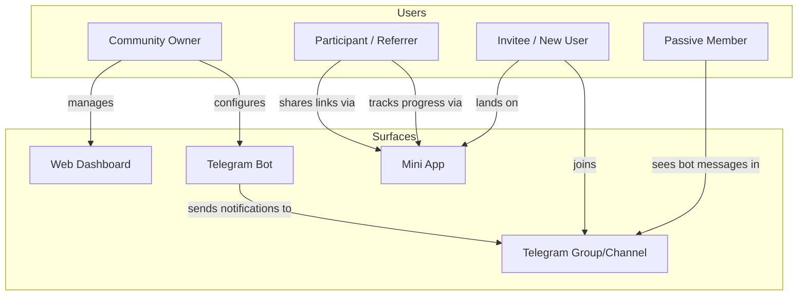
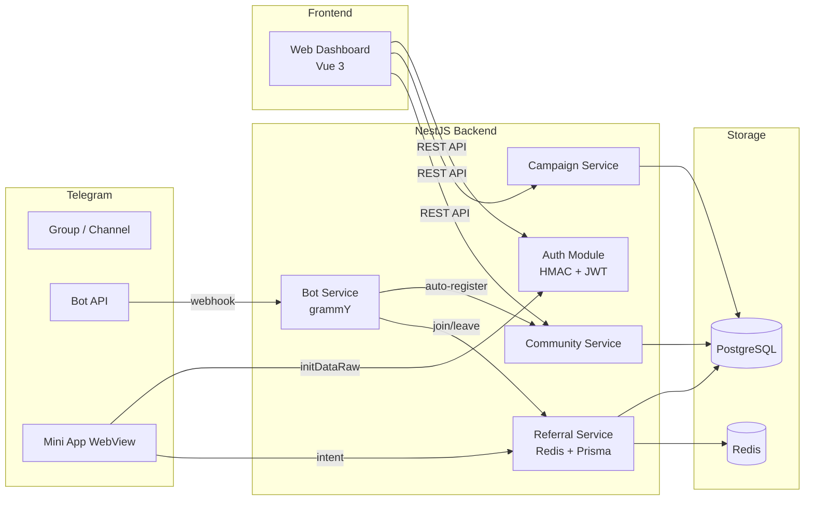
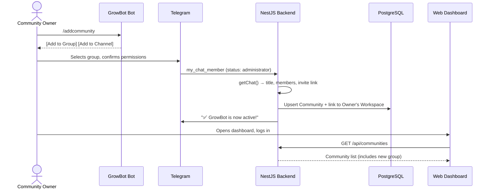
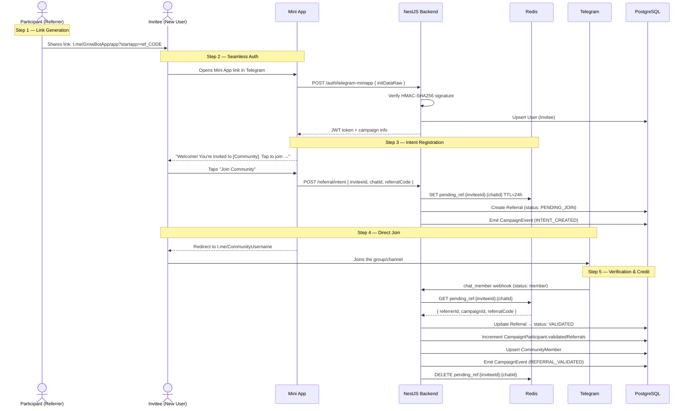
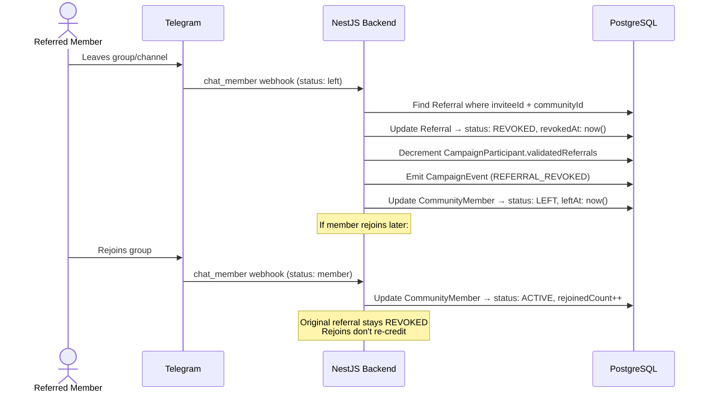

# GrowBot — Features & User Flows

> Reference: [phase-1.md](phase-1.md) · [db-design.md](db-design.md)

---

## 1. User Roles

GrowBot serves four distinct user types. Each interacts with different surfaces (Bot, Mini App, Web Dashboard) in different ways.

| Role | Who They Are | Primary Interface | Auth Method |
|------|-------------|-------------------|-------------|
| **Community Owner** | Telegram group/channel admin | Web Dashboard + Bot | Telegram Web Login Widget |
| **Participant** | Community member who opts into a campaign and invites others | Mini App + Bot | Telegram Mini App `initDataRaw` |
| **Invitee** | Person outside the community who receives a referral link | Mini App → Telegram | Telegram Mini App `initDataRaw` |
| **Passive Member** | Community member who has not joined any campaign | Bot (read-only) | None required |



---

## 2. System Architecture Overview



---

## 3. Community Owner Flows

The Community Owner is the primary administrator. They manage everything through the **Web Dashboard** and configure the bot via Telegram.

### 3.1 Onboarding (First-Time Setup)

```
Step 1: Owner opens the bot on Telegram → /start
Step 2: Owner sends /addcommunity → taps "Add to Group" or "Add to Channel"
Step 3: Telegram prompts → owner selects their group/channel → confirms admin permissions
Step 4: Bot receives my_chat_member webhook → auto-registers community in PostgreSQL
Step 5: Bot sends confirmation: "✅ GrowBot is now active! Open Dashboard →"
Step 6: Owner opens Web Dashboard → logs in via Telegram Web Login Widget
Step 7: Dashboard shows the newly registered community under their workspace
```



**Database records created:**
- `User` — upserted from Owner's Telegram ID
- `Workspace` — created if owner doesn't have one (default FREE plan)
- `Community` — linked to workspace, `botStatus: ACTIVE`

---

### 3.2 Creating a Campaign

```
Step 1: Owner opens Dashboard → navigates to community → "Create Campaign"
Step 2: Fills campaign wizard:
        - Title: "Invite 10 Friends, Get VIP Access"
        - Type: MILESTONE or LEADERBOARD
        - Referral Target: 10 (for MILESTONE)
        - Reward Description: "VIP Access for 30 days"
        - Validation Rules: IMMEDIATE / TIME_BOUND (24h) / MESSAGE_COUNT (1)
        - Start Date / End Date
Step 3: Saves as DRAFT → reviews → sets status to ACTIVE
Step 4: Bot announces campaign in the community chat (optional notification)
```

**Database records created:**
- `Campaign` — linked to community, `status: ACTIVE`
- `CampaignValidationRule` — one or more rules attached to campaign

---

### 3.3 Monitoring & Management (Ongoing)

| Feature | What Owner Sees | API Endpoint |
|---------|----------------|--------------|
| **Dashboard Overview** | Total referrals, active campaigns, communities, members | `GET /api/workspaces` |
| **Community Health** | Member count, bot status, daily growth chart | `GET /api/communities` |
| **Campaign Performance** | Participants, validated referrals, conversion rate | `GET /api/campaigns/:id` |
| **Leaderboard** | Ranked list of top referrers with invite counts | `GET /api/campaigns/:id/leaderboard` |
| **Reward Fulfillment** | Pending rewards → approve / deliver / reject | `PATCH /api/rewards/:id/status` |
| **Analytics** | Daily joins, leaves, referral conversions (7/30/90 day) | `GET /api/communities/:id/stats` |
| **Export** | Download CSV of campaign data | `GET /api/campaigns/:id/export` |

---

### 3.4 Managing Rewards

```
Step 1: Participant reaches campaign target (e.g. 10 validated referrals)
Step 2: System auto-creates Reward record with status: PENDING
Step 3: Owner sees pending reward in Dashboard → reviews referral quality
Step 4: Owner clicks "Approve" → status: APPROVED
Step 5: Owner fulfills reward externally (sends VIP access, prize, etc.)
Step 6: Owner clicks "Mark as Delivered" → status: DELIVERED
```

> **Note:** Reward fulfillment is manual in Phase 1. GrowBot only tracks the status, not the actual delivery.

---

## 4. Participant Flows (Community Member Who Refers)

A Participant is an existing community member who opts into a campaign and actively invites others using a referral link.

### 4.1 Joining a Campaign

```
Step 1: Member sees campaign announcement in group (bot notification)
        OR opens Mini App from bot's /start message
Step 2: Mini App authenticates via initDataRaw (zero-tap, automatic)
Step 3: Member sees active campaigns for their community
Step 4: Taps "Join Campaign" → system generates unique referral code
Step 5: Member gets a shareable referral link:
        https://t.me/GrowBotApp/app?startapp=ref_UNIQUECODE
```

**Database records created:**
- `CampaignParticipant` — links user to campaign with unique `referralCode`

---

### 4.2 Sharing & Tracking Referrals

```
Step 1: Participant shares referral link with friends (Telegram, social media, etc.)
Step 2: Each time an invitee joins via their link:
        - Participant sees count update in Mini App
        - Progress bar moves: "3 / 10 referrals"
Step 3: Mini App shows:
        - Active campaigns with progress
        - Referral history (who joined, pending/validated/revoked)
        - Earned rewards
        - Leaderboard ranking
```

**Mini App views for Participant:**
- Campaign list with progress bars
- Referral link with share/copy button
- Leaderboard position
- Reward status

---

### 4.3 Earning a Reward

```
MILESTONE campaign:
  → Participant hits target (e.g. 10 validated referrals)
  → System creates Reward record (status: PENDING)
  → Participant sees "🎉 Reward Earned!" in Mini App
  → Owner approves and fulfills

LEADERBOARD campaign:
  → Campaign end date arrives
  → System ranks participants by validatedReferrals
  → Top N participants earn rewards
  → Owner approves and fulfills
```

---

## 5. Invitee Flows (Person Outside the Community)

The Invitee is someone who has never been in the community. They receive a referral link and go through the attribution funnel.

### 5.1 The 5-Step Referral Attribution Flow

This is the core engine of GrowBot. It attributes referrals reliably without relying on Telegram's invite link API (which has rate limits).



**What the Invitee sees:**
1. Opens link → Mini App launches inside Telegram (no separate app install)
2. "Welcome! You're invited to **AI Alpha Community** by **@alex_web3**"
3. Campaign info: "Join and help unlock rewards!"
4. Big "Join Community" button
5. Redirected to Telegram group → joins normally
6. Done — they're now a community member

---

### 5.2 What Happens After Joining

Once the invitee joins:
- They become a **Passive Member** of the community
- They can optionally become a **Participant** themselves by joining campaigns
- If they leave the community, the referral credit is **revoked** (anti-cheat)

---

## 6. Anti-Cheat: Leave & Revocation Flow

GrowBot prevents gaming the referral system by revoking credit when referred members leave.



**Key anti-cheat rules:**
- Leaving revokes the referral credit immediately
- Rejoining does NOT restore the revoked referral
- `CommunityMember.rejoinedCount` tracks abuse patterns
- `CommunityMember.firstJoinedAt` preserves the original join date

---

## 7. Validation Rules

When a referral is attributed, it may need to pass validation rules before being credited. The admin configures these per campaign.

| Rule Type | How It Works | Config Example |
|-----------|-------------|----------------|
| **IMMEDIATE** | Referral is validated instantly when the invitee joins | `{}` |
| **TIME_BOUND** | Invitee must stay in the community for X hours before validation | `{ "min_hours": 24 }` |
| **MESSAGE_COUNT** | Invitee must send at least X messages in the group before validation | `{ "min_messages": 1 }` |

Multiple rules can be combined per campaign (e.g. stay 24h AND send 1 message).

```
Referral lifecycle with TIME_BOUND validation:

  Intent Created → Invitee Joins → status: PENDING_VALIDATION
                                    ↓
                        Background job waits 24 hours
                                    ↓
                    Is invitee still a member? ──No──→ status: INVALIDATED
                                    ↓ Yes
                            status: VALIDATED
                        Increment referrer's count
```

---

## 8. Passive Member Experience

Passive members are community members who haven't joined any campaign. Their interaction with GrowBot is minimal.

**What they see:**
- Bot messages in the group (campaign announcements, welcome messages)
- Can DM the bot → `/start` opens the Mini App
- Can use `/stats` to see if they have any referral activity
- Can join campaigns at any time via the Mini App

**What the system tracks about them:**
- `CommunityMember` record (join date, message count, status)
- No `CampaignParticipant` record until they opt in

---

## 9. Notification Flow

Bot sends notifications to the community chat at key moments:

| Event | Message | Audience |
|-------|---------|----------|
| Bot added to group | "✅ GrowBot is now active!" | Everyone in group |
| Campaign goes ACTIVE | "🚀 New campaign: Invite 10 friends for VIP!" | Everyone in group |
| Someone hits milestone | "🎉 @user just reached 10 referrals!" | Everyone in group |
| Campaign ends | "🏁 Campaign ended! Top inviter: @user with 25 referrals" | Everyone in group |
| Reward approved | "🎁 Your reward has been approved!" | DM to participant |

---

## 10. Interface Summary — Who Sees What

### Web Dashboard (Community Owner Only)

| Page | Content |
|------|---------|
| **Dashboard** | Overview stats, growth chart, quick actions |
| **Communities** | List of connected groups/channels, bot status, member count |
| **Campaigns** | Campaign cards with status, type, progress, validation rules |
| **Leaderboard** | Ranked participant table per campaign |
| **Rewards** | Pending / approved / delivered rewards with action buttons |
| **Settings** | Workspace name, plan, danger zone |

### Mini App (Participants & Invitees)

| View | Participant Sees | Invitee Sees |
|------|-----------------|--------------|
| **Landing** | Active campaigns with progress | "You're invited to [Community]!" |
| **Campaign Detail** | Progress bar, referral link, share button | Campaign info, "Join" button |
| **My Referrals** | List of people they invited + status | — |
| **Leaderboard** | Their rank among participants | — |
| **Rewards** | Earned rewards + status | — |

### Bot Commands (Everyone)

| Command | What It Does |
|---------|-------------|
| `/start` | Welcome message + Mini App button |
| `/addcommunity` | Deep-link buttons to add bot to group/channel |
| `/stats` | Personal referral metrics |
| `/help` | Command reference + setup instructions |

---

## 11. Data Flow Summary

How each user action maps to database writes:

| Action | Tables Affected |
|--------|----------------|
| Owner adds bot to group | `User` ↑, `Workspace` ↑, `Community` ↑ |
| Owner creates campaign | `Campaign` ↑, `CampaignValidationRule` ↑ |
| Member joins campaign | `CampaignParticipant` ↑ |
| Invitee opens referral link | `User` ↑ (upsert) |
| Invitee taps "Join Community" | `Referral` ↑, `CampaignEvent` ↑, Redis key set |
| Invitee joins group | `CommunityMember` ↑, `Referral` ✎, `CampaignParticipant` ✎, `CampaignEvent` ↑, Redis key deleted |
| Member leaves group | `CommunityMember` ✎, `Referral` ✎ (REVOKED), `CampaignParticipant` ✎ (decrement), `CampaignEvent` ↑ |
| Participant hits target | `Reward` ↑, `CampaignEvent` ↑ |
| Owner approves reward | `Reward` ✎ |

↑ = created · ✎ = updated

---

## 12. Campaign Types

### MILESTONE — "Invite X Friends"

- Fixed target (e.g. invite 10 friends)
- Every participant who reaches the target earns the reward
- No competition between participants
- Good for: mass participation, guaranteed rewards

```
Target: 10 referrals → Reward: VIP Access

Participant A: 10/10 → ✅ Reward earned
Participant B:  7/10 → ⏳ In progress
Participant C: 10/10 → ✅ Reward earned
```

### LEADERBOARD — "Top Inviter Competition"

- No fixed target
- Participants compete for highest referral count
- Top N participants earn rewards when campaign ends
- Good for: driving maximum growth, competitive communities

```
Campaign ends July 31st → Top 3 win prizes

#1  @alice   — 47 referrals → 🥇 $500 prize
#2  @bob     — 31 referrals → 🥈 $200 prize
#3  @charlie — 28 referrals → 🥉 $100 prize
#4  @dave    — 15 referrals → No reward
```

---

## 13. Workspace & Plan Limits

| Feature | FREE | PRO | ENTERPRISE |
|---------|------|-----|------------|
| Max Communities | 3 | 10 | Unlimited |
| Max Active Campaigns | 5 | 25 | Unlimited |
| Analytics Retention | 30 days | 1 year | Unlimited |
| Data Export | ❌ | CSV | CSV + API |
| Priority Support | ❌ | ✅ | ✅ |

> Plans are configurable per workspace via `maxCommunities` and `maxCampaigns` fields.

---

## 14. Security Model

| Layer | Mechanism |
|-------|-----------|
| **Mini App Auth** | HMAC-SHA256 on `initDataRaw` using `HMAC(key=HMAC("WebAppData", botToken), data)` |
| **Web Dashboard Auth** | HMAC-SHA256 on login widget data using `HMAC(key=SHA256(botToken), data)` |
| **API Auth** | JWT Bearer tokens (7-day access + 30-day refresh) |
| **Webhook Verification** | `X-Telegram-Bot-Api-Secret-Token` header check |
| **Referral Integrity** | Redis TTL (24h), unique constraint `(campaign_id, invitee_id)`, anti-cheat revocation |
| **Input Validation** | `class-validator` DTOs on all endpoints |
| **Timing Safety** | `crypto.timingSafeEqual` for all hash comparisons |
