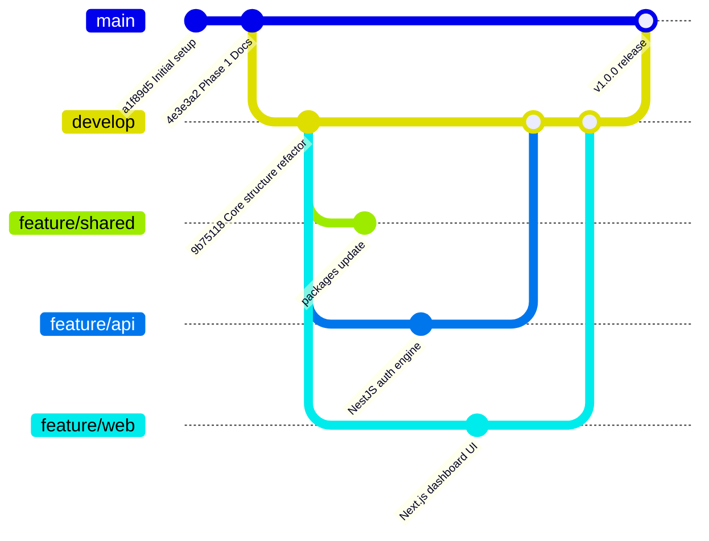

# GrowBot - Git Branching Strategy & Workflow Guidelines

This document outlines the Git setup, branch hierarchy, naming conventions, commit standards, and step-by-step developer workflows for the **GrowBot** monorepo repository.

---

## 📌 Table of Contents

- [1. Overview & Repository Architecture](#1-overview--repository-architecture)
- [2. Branch Setup & Hierarchy](#2-branch-setup--hierarchy)
- [3. Domain-Driven Feature Branches](#3-domain-driven-feature-branches)
- [4. Commit Message Conventions](#4-commit-message-conventions)
- [5. Developer Workflows & Step-by-Step Guide](#5-developer-workflows--step-by-step-guide)
  - [Workflow A: Developing a New Feature](#workflow-a-developing-a-new-feature)
  - [Workflow B: Keeping Your Feature Branch Updated](#workflow-b-keeping-your-feature-branch-updated)
  - [Workflow C: Submitting a Pull Request & Merging](#workflow-c-submitting-a-pull-request--merging)
  - [Workflow D: Non-Critical Bug Fixes (`fix/*`)](#workflow-d-non-critical-bug-fixes-fix)
  - [Workflow E: Emergency Production Hotfixes (`hotfix/*`)](#workflow-e-emergency-production-hotfixes-hotfix)
  - [Workflow F: Production Release (`develop` ➔ `main`)](#workflow-f-production-release-develop--main)
- [6. Useful Git Commands & Cheat Sheet](#6-useful-git-commands--cheat-sheet)
- [7. Golden Rules & Best Practices](#7-golden-rules--best-practices)

---

## 1. Overview & Repository Architecture

GrowBot uses a **Turborepo + pnpm workspaces** monorepo architecture:

```
├── apps/
│   ├── api/             # Backend API, NestJS & Telegram Bot Service
│   └── web/             # Web Dashboard & Telegram Mini App Frontend
├── packages/
│   ├── database/        # Prisma ORM schema, migrations & Redis client
│   └── typescript-config# Shared TypeScript configurations
└── doc/                 # Project documentation & guidelines
```

To support simultaneous development across frontend, backend, and database layers, our Git setup uses a **Domain-Driven Gitflow** model with designated long-lived domain branches alongside standard `main` and `develop` branches.

---

## 2. Branch Setup & Hierarchy



### Branch Types Overview

| Branch Name | Type | Target Scope | Source Branch | Merges Into |
| :--- | :--- | :--- | :--- | :--- |
| `main` | Production | Live production code & releases | `develop` / `hotfix/*` | Protected (No direct commits) |
| `develop` | Integration | Active development & staging | Feature branches | `main` |
| `feature/shared` | Core Domain | `packages/database`, `packages/typescript-config` | `develop` | `develop` |
| `feature/api` | Core Domain | `apps/api` (NestJS backend, grammY Bot, Redis) | `develop` | `develop` |
| `feature/web` | Core Domain | `apps/web` (Next.js Dashboard, Mini App) | `develop` | `develop` |
| `feature/<short-desc>` | Topic Feature | Specific isolated feature or subtask | `develop` or Domain Branch | Domain Branch / `develop` |
| `fix/<short-desc>` | Bug Fix | Non-critical bug fix | `develop` | `develop` |
| `hotfix/<short-desc>` | Hotfix | Critical production bug fix | `main` | `main` AND `develop` |

---

## 3. Domain-Driven Feature Branches

Because GrowBot is a monorepo, work is segmented into three core domain branches:

1. **`feature/shared`**
   - **Scope:** `packages/database`, Prisma schema, Redis configurations, shared TypeScript config, and global types.
   - **Use Case:** Database schema updates, seed script changes, shared utilities.

2. **`feature/api`**
   - **Scope:** `apps/api` (NestJS, Telegram Webhook handlers, Redis intent attribution, JWT auth, background jobs).
   - **Use Case:** Building backend REST APIs, Telegram bot features, event sourcing listeners.

3. **`feature/web`**
   - **Scope:** `apps/web` (Next.js Web Dashboard, Telegram Mini App UI, Tailwind CSS components, TanStack Query integration).
   - **Use Case:** Building admin dashboard pages, Telegram Mini App screens, UI components.

4. **Short-Lived Topic Branches (`feature/<domain>-<name>`)**
   - For scoped tasks assigned to single developers (e.g. `feature/web-leaderboard-chart` or `feature/api-redis-attribution`).

---

## 4. Commit Message Conventions

GrowBot follows the **Conventional Commits** specification. Clear commit messages make change history easy to audit and enable automated release notes.

### Format

```text
<type>(<scope>): <short descriptive summary in imperative present tense>
```

### Types

- `feat`: A new feature for the user or system.
- `fix`: A bug fix.
- `docs`: Documentation changes only (e.g. `doc/*.md` or `README.md`).
- `style`: Code formatting, missing semi-colons, white-space (no production code change).
- `refactor`: Refactoring production code without adding features or fixing bugs.
- `perf`: Code changes that improve performance.
- `test`: Adding missing tests or correcting existing tests.
- `chore`: Maintenance tasks, dependency updates, Turbo/pnpm script updates.
- `ci`: CI/CD configuration changes.

### Monorepo Scopes

- `web`: Changes in `apps/web` (Dashboard / Mini App).
- `api`: Changes in `apps/api` (NestJS Backend / Bot).
- `db`: Changes in `packages/database` (Prisma / SQL).
- `config`: Shared configs (`packages/typescript-config`, `turbo.json`, `pnpm-workspace.yaml`).
- `deps`: Root dependencies or `package.json` updates.

### Examples

```bash
feat(api): implement Telegram initDataRaw HMAC authentication module
feat(web): add leaderboard ranking component with Tailwind CSS
fix(db): resolve unique constraint violation on CampaignParticipant
docs(git): update git branching guidelines for monorepo workflow
chore(deps): upgrade turbo to v2.0.0
```

---

## 5. Developer Workflows & Step-by-Step Guide

### Workflow A: Developing a New Feature

1. **Fetch latest remote changes:**
   ```bash
   git fetch origin
   ```

2. **Switch to `develop` and update:**
   ```bash
   git checkout develop
   git pull origin develop
   ```

3. **Create your feature branch:**
   - For domain work (`web`, `api`, `shared`), checkout the core domain branch or create a scoped topic branch:
   ```bash
   # Option 1: Work on core domain branch
   git checkout feature/api
   git pull origin feature/api

   # Option 2: Create a short-lived topic feature branch off develop
   git checkout -b feature/api-hmac-auth develop
   ```

4. **Make your changes, test locally:**
   ```bash
   pnpm dev
   pnpm build
   ```

5. **Stage and commit with conventional commit format:**
   ```bash
   git add .
   git commit -m "feat(api): add HMAC verification for Telegram Mini App auth"
   ```

6. **Push to remote repository:**
   ```bash
   git push -u origin feature/api-hmac-auth
   ```

---

### Workflow B: Keeping Your Feature Branch Updated

Before submitting a Pull Request, make sure your branch is up to date with `develop` to prevent merge conflicts.

```bash
# Fetch latest remote changes
git fetch origin

# Rebase your branch onto origin/develop
git checkout feature/api-hmac-auth
git rebase origin/develop

# If there are conflicts:
# 1. Resolve conflicts in your editor
# 2. Stage resolved files: git add <file>
# 3. Continue rebase: git rebase --continue

# Push updated branch (force push with lease if rebased)
git push --force-with-lease origin feature/api-hmac-auth
```

---

### Workflow C: Submitting a Pull Request & Merging

1. Open a Pull Request (PR) on GitHub targeting `develop` (or target core domain branch).
2. Ensure CI checks pass (`pnpm build`, `pnpm lint`).
3. Request code review from at least 1 teammate.
4. Once approved, merge using **Squash and Merge** or **Rebase and Merge** to maintain a clean git history.
5. Delete the temporary topic branch after merging.

---

### Workflow D: Non-Critical Bug Fixes (`fix/*`)

1. **Branch off `develop`:**
   ```bash
   git checkout develop
   git pull origin develop
   git checkout -b fix/referral-count-decrement
   ```

2. **Fix bug, write tests, commit:**
   ```bash
   git commit -m "fix(api): correct referral credit deduction when member leaves"
   ```

3. **Push and create PR targeting `develop`:**
   ```bash
   git push -u origin fix/referral-count-decrement
   ```

---

### Workflow E: Emergency Production Hotfixes (`hotfix/*`)

Critical bugs affecting production require immediate fixing on `main`.

1. **Branch off `main`:**
   ```bash
   git checkout main
   git pull origin main
   git checkout -b hotfix/telegram-webhook-auth-leak
   ```

2. **Apply fix and commit:**
   ```bash
   git commit -m "fix(api): resolve secret token validation vulnerability in webhook receiver"
   ```

3. **Create PR targeting `main`:**
   - Once merged into `main` and deployed, **back-merge `main` into `develop`**:
   ```bash
   git checkout develop
   git pull origin develop
   git merge main
   git push origin develop
   ```

---

### Workflow F: Production Release (`develop` ➔ `main`)

When a development phase/milestone is completed and tested in staging:

1. **Create Release PR:**
   - Target: `main`
   - Source: `develop`
   - Title: `release: v1.0.0 Phase 1 MVP`
2. **Execute Deployment & Tag Release:**
   ```bash
   git checkout main
   git pull origin main
   git tag -a v1.0.0 -m "Release v1.0.0 - Phase 1 MVP"
   git push origin v1.0.0
   ```

---

## 6. Useful Git Commands & Cheat Sheet

### Branch Inspection & Management

```bash
# List local & remote branches with latest commit info
git branch -a -v

# Check status of working directory
git status

# Visual graph of commit history across all branches
git log --all --graph --oneline --decorate -n 20
```

### Undoing Changes & Cleaning Up

```bash
# Discard uncommitted local changes in a specific file
git checkout -- <file-path>

# Unstage a file while keeping changes in working directory
git restore --staged <file-path>

# Clean untracked files and directories (excluding .gitignore)
git clean -fd

# Reset local branch to match remote origin exactly
git reset --hard origin/develop
```

### Stashing Work in Progress

```bash
# Save uncommitted work to stash
git stash save "WIP: mini app referral modal"

# List stashes
git stash list

# Re-apply most recent stash
git stash pop
```

---

## 7. Golden Rules & Best Practices

1. 🚫 **Never Commit Directly to `main` or `develop`**: Always work on domain feature branches or short-lived topic branches and submit Pull Requests.
2. 🔒 **Never Commit Secrets or Local Environment Files**: Keep `.env`, `.env.local`, `.env.prod`, and credentials out of Git. Verify `.gitignore` before committing.
3. 📦 **Keep `pnpm-lock.yaml` Synchronized**: Always commit `pnpm-lock.yaml` when adding or updating package dependencies. Do not edit lockfiles manually.
4. 🗄 **Prisma Schema & Migrations**: Commit Prisma migration files in `packages/database/prisma/migrations/` whenever updating `schema.prisma`. Never edit existing migration SQL files after they are pushed.
5. 🧪 **Verify Local Builds Before Pushing**: Run `pnpm build` and `pnpm lint` locally before opening a PR to catch Turborepo build failures early.
6. 🧼 **Clean Commit History**: Use descriptive conventional commit messages. Avoid commits named `fix`, `wip`, `test`, or `asdf`.
