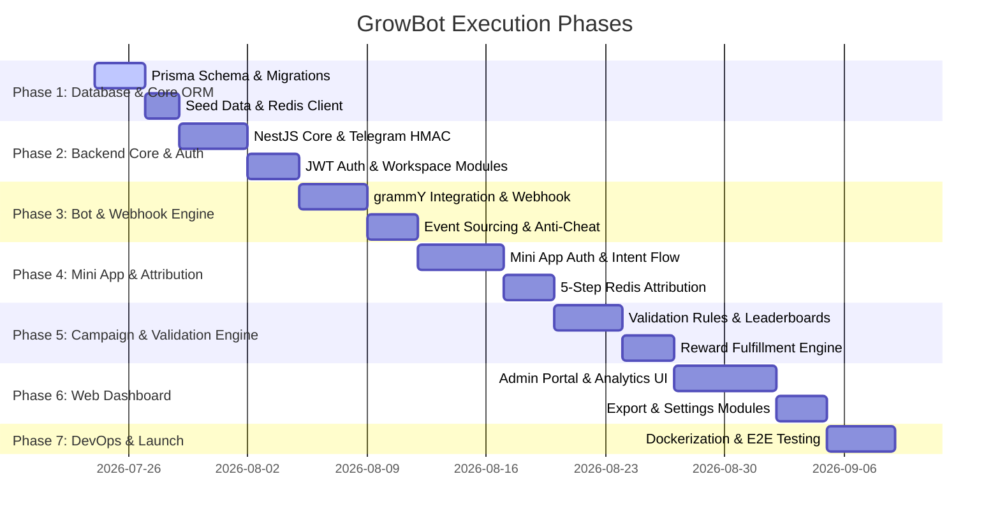

# GrowBot - Master Implementation Roadmap & Phased Execution Plan

This document outlines the step-by-step master execution plan for **GrowBot** based on the Phase 1 Product Specification (`assets/phase-1.md`) and Database Schema Specification (`assets/db-design.md`).

---

## 🏗 Architectural Summary

GrowBot consists of three core components:
1. **NestJS Backend API & Telegram Bot** – Manages Telegram webhooks (`chat_member`), Redis referral intent validation, event sourcing, background jobs, and REST APIs.
2. **Telegram Mini App (Next.js/React)** – Provides seamless 1-tap Telegram authentication (`initDataRaw` HMAC validation), rate-limit-free referral intent registration, and member progress views.
3. **Web Dashboard (Next.js/React)** – Centralized administration portal for community owners to manage workspaces, configure campaigns and validation rules, inspect growth analytics, and fulfill rewards.

---

## 🗺 Implementation Phases Overview

---

## Phase 1: Database Architecture & Core Data Access Layer

**Goal:** Establish PostgreSQL database schema with Prisma ORM, Redis caching layer, seed scripts, and core data models.

### Tasks
- [ ] Initialize Prisma ORM in `backend` project with PostgreSQL connector.
- [ ] Implement full `schema.prisma` definition matching `assets/db-design.md`:
  - `User`, `Workspace`, `Community`, `Campaign`, `CampaignValidationRule`, `CommunityMember`, `CampaignParticipant`, `Referral`, `CampaignEvent`, `Reward`, `CommunityDailyStat`, `TelegramEventLog`.
- [ ] Create initial Prisma migration (`0_init`).
- [ ] Configure Redis client connection for:
  - Temporary referral intent storage (`pending_ref:{inviteeId}:{communityChatId}`).
  - JWT session storage.
  - Rate limiting.
- [ ] Write seed script (`prisma/seed.ts`) generating sample admin user, workspace, community, campaign, and member data for testing.

### Deliverables & Verification
- `npx prisma validate` and `npx prisma migrate dev` complete cleanly.
- `npx prisma db seed` successfully populates test records.
- Redis connectivity test script succeeds.

---

## Phase 2: Backend Infrastructure & NestJS API Core

**Goal:** Build the core NestJS API backend, Telegram cryptographic authentication, JWT session management, and workspace CRUD.

### Tasks
- [ ] Initialize NestJS backend repository with TypeScript, Pino logging, and ConfigModule.
- [ ] **Telegram Authentication Module**:
  - Implement HMAC-SHA256 verification algorithm for Telegram Mini App `initDataRaw` and Telegram Web Widget login data.
  - Implement JWT token generation & refresh logic.
  - Implement `@AuthUser()` decorator and `JwtAuthGuard`.
- [ ] **Workspace Management Module**:
  - CRUD operations for `Workspace` (`FREE`, `PRO`, `ENTERPRISE` plan enforcement).
  - Role-based authorization (`WorkspaceGuard`).
- [ ] **Community Management Module**:
  - Community registration & configuration API.
  - Community membership sync helper services.

### Deliverables & Verification
- Unit tests for Telegram HMAC signature verification.
- Endpoints for `POST /auth/telegram-miniapp` and `POST /auth/telegram-web` verified via Postman/Supertest.
- Workspace creation and community listing endpoints working with JWT protection.

---

## Phase 3: Telegram Bot Engine & Webhook Event Receiver

**Goal:** Integrate the Telegram Bot API using grammY, handle webhooks securely, process group/channel membership events, and implement event sourcing & anti-cheat revocation.

### Tasks
- [ ] Integrate **grammY** framework into NestJS.
- [ ] Setup secure Telegram Webhook endpoint (`POST /telegram/webhook`) with secret token verification (`X-Telegram-Bot-Api-Secret-Token`).
- [ ] **Membership Webhook Listener**:
  - Process `chat_member` and `my_chat_member` updates.
  - Update `CommunityMember` state (setting `first_joined_at` on first join or incrementing `rejoined_count` on re-join).
  - Log raw updates in `TelegramEventLog`.
- [ ] **Event Sourcing Engine**:
  - Emit immutable `CampaignEvent` records for `MEMBER_JOINED`, `MEMBER_LEFT`, `BOT_STATUS_CHANGED`.
- [ ] **Anti-Cheat Credit Revocation**:
  - Handle `chat_member.status === "left" | "kicked"`.
  - Locate existing `Referral` record -> mark status as `REVOKED`, set `revokedAt`.
  - Decrement `validatedReferrals` on `CampaignParticipant` and emit `REFERRAL_REVOKED` event.

### Deliverables & Verification
- Webhook receiver responds within < 200ms to Telegram API test requests.
- Member join/leave webhook updates properly trigger database state changes and `CampaignEvent` creation.

---

## Phase 4: Telegram Mini App & 5-Step Referral Attribution Engine

**Goal:** Build the Telegram Mini App frontend and complete the 5-step Redis-backed referral attribution flow.

### Tasks
- [ ] **Mini App Frontend (Next.js)**:
  - Setup Next.js app with Telegram WebApp SDK (`@twa-dev/sdk`).
  - Implement automatic Telegram 1-tap authentication on app mount.
  - Mini App UI: Campaign landing view (*"Welcome! You're invited to [Community Name]"*), referral progress bar, earned rewards list.
- [ ] **5-Step Referral Attribution Flow**:
  - **Step 1**: Inviter generates Mini App link `https://t.me/GrowBotApp/app?startapp=ref_CODE`.
  - **Step 2**: Invitee opens Mini App; backend authenticates `initDataRaw`.
  - **Step 3 (Intent Registration)**: Invitee taps *"Join Community"*; NestJS writes Redis key `pending_ref:{inviteeId}:{communityChatId}` (24h TTL) and emits `INTENT_CREATED` event.
  - **Step 4**: Invitee is redirected to Telegram group/channel and joins.
  - **Step 5 (Attribution & Credit)**: Bot webhook receives join -> matches against Redis key -> creates `Referral` -> evaluates `CampaignValidationRule` -> emits `REFERRAL_VALIDATED` event -> deletes Redis key.

### Deliverables & Verification
- Complete end-to-end simulated referral test from link tap to PostgreSQL credit.
- Zero Bot API rate limits incurred during link generation.

---

## Phase 5: Campaign Engine & Validation Rules

**Goal:** Build the campaign lifecycle manager, validation rule engine, leaderboard calculator, and reward fulfillment service.

### Tasks
- [ ] **Campaign Management API**:
  - Create/Update/Pause/Delete campaigns (`MILESTONE` vs `LEADERBOARD`).
  - Attach normalized `CampaignValidationRule` records (`IMMEDIATE`, `TIME_BOUND`, `MESSAGE_COUNT`).
- [ ] **Validation Rule Engine**:
  - `IMMEDIATE`: Validate referral instantly upon join.
  - `TIME_BOUND`: Queue background job (BullMQ/Redis) to check membership after configured hours (e.g. 24h).
  - `MESSAGE_COUNT`: Listener for group messages to increment `CommunityMember.messageCount` until target reached.
- [ ] **Leaderboard Engine**:
  - Fast query service for campaign rankings using `@@index([campaignId, validatedReferrals(sort: Desc)])`.
- [ ] **Reward Management Module**:
  - Automatic reward issuance when target reached or campaign ends.
  - Admin reward status updates (`PENDING`, `APPROVED`, `DELIVERED`, `REJECTED`).

### Deliverables & Verification
- Unit & integration tests for all 3 validation rule types (`IMMEDIATE`, `TIME_BOUND`, `MESSAGE_COUNT`).
- Leaderboard ranking API returning top inviters correctly sorted.

---

## Phase 6: Web Dashboard (Admin Portal)

**Goal:** Develop a modern, responsive Web Dashboard for community owners to manage campaigns, monitor analytics, and oversee rewards.

### Tasks
- [ ] **Frontend Foundation**:
  - Next.js, TypeScript, Tailwind CSS, shadcn/ui, TanStack Query, Recharts.
  - Dark mode aesthetic with glassmorphism design system.
- [ ] **Authentication & Workspace Navigation**:
  - Telegram Web Login widget & JWT session persistence.
  - Workspace selector & community onboarding wizard.
- [ ] **Community & Campaign Management Pages**:
  - Community health status, bot permissions inspector.
  - Campaign builder wizard (title, description, reward, validation rules, target).
- [ ] **Analytics & Leaderboard Dashboard**:
  - Real-time growth charts (daily joins, leaves, conversion rates).
  - Live campaign leaderboards.
- [ ] **Member & Reward Fulfillment Table**:
  - Member management table with `first_joined_at`, `rejoined_count`, and referral history.
  - Reward fulfillment approval/rejection workflow.
  - CSV/Excel data export for campaign reports.

### Deliverables & Verification
- Dashboard loads within < 1.5 seconds.
- Fully functional campaign creation and reward status management UI.
- Export functionality produces valid CSV files.

---

## Phase 7: Infrastructure, Testing, Monitoring & Production Deployment

**Goal:** Dockerize the stack, execute end-to-end load testing, configure monitoring, and deploy to production.

### Tasks
- [ ] **Containerization**:
  - Write multi-stage Dockerfiles for NestJS Backend, Next.js Dashboard, Next.js Mini App.
  - `docker-compose.yml` orchestrating Postgres, Redis, NestJS, Dashboard, Mini App, and Nginx reverse proxy.
- [ ] **Security Auditing**:
  - Enforce rate limiting on Mini App endpoints.
  - Webhook secret header validation.
  - Input validation sanitization (`class-validator`).
- [ ] **CI/CD Pipeline**:
  - GitHub Actions workflow for linting, testing, building, and deployment to VPS (DigitalOcean / Hetzner).
- [ ] **Monitoring & Logging**:
  - Integrate Sentry for runtime error tracking.
  - Health check endpoints (`/health`).

### Deliverables & Verification
- `docker-compose up` launches entire stack cleanly.
- CI/CD pipeline builds and passes all automated tests.
- Uptime monitoring and webhook health confirmed.

---

## 🎯 Summary of Key Deliverables by File

- 📄 **[assets/phase-1.md](assets/phase-1.md)**: Product Specification & Functional Requirements.
- 🗄 **[assets/db-design.md](assets/db-design.md)**: Database Architecture, ERD, and Prisma Schema.
- 🗺 **[assets/plan.md](assets/plan.md)**: Master Implementation Roadmap (Phases 1 - 7).
- 📘 **[README.md](../README.md)**: Project Overview & Architecture Guide.
