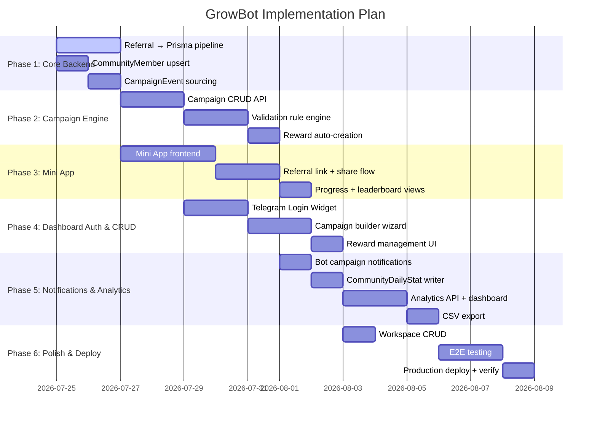

# GrowBot — Implementation Plan

> Based on [features.md](features.md) · [phase-1.md](phase-1.md) · [db-design.md](db-design.md)

---

## Current State Summary

### ✅ Done

| Area | What's Built |
|------|-------------|
| **Database** | Full Prisma schema (12 models), seeded local + production PostgreSQL |
| **Auth** | HMAC-SHA256 for Mini App + Web Widget, JWT (access + refresh), user upsert, `@AuthUser()` decorator, `JwtAuthGuard`, `@Public()` decorator |
| **Bot** | grammY integration, webhook + long-polling dual mode, `/start`, `/help`, `/stats`, `/addcommunity` commands, `my_chat_member` auto-registration, `chat_member` join/leave tracking, anti-cheat revocation |
| **Community** | Auto-registration from `my_chat_member`, upsert with workspace linking, bot status tracking, `GET /communities` with Prisma |
| **Campaigns** | `GET /campaigns` (Prisma with relations), `GET /campaigns/:id/leaderboard` (Prisma), mock `POST /campaigns` |
| **Rewards** | `GET /rewards` (Prisma), mock `PATCH /rewards/:id/status` |
| **Referral** | Referral intent registration (`POST /referral/intent`), intent lookup + validation on join, revocation on leave — **PostgreSQL + Prisma with memory fallback** |
| **Dashboard** | Vue 3 + Vite + Pinia — 6 views (Dashboard, Campaigns, Leaderboard, Rewards, Communities, Settings), 8 components, 2 stores fetching from live API |
| **Deployment** | Vercel serverless (NestJS) + static (Vue 3), webhook registered, production DB seeded |

### ⬜ Not Built

| Area | What's Missing |
|------|---------------|
| **Campaign CRUD** | No real create/update/pause/delete — `POST /campaigns` is mock |
| **Reward CRUD** | `PATCH /rewards/:id/status` is mock, no auto-creation on target reached |
| **Workspace CRUD** | `create()` and `findOne()` use mock data, not Prisma |
| **Mini App** | No Mini App frontend — no campaign landing, referral link sharing, or progress views |
| **Validation Engine** | No `TIME_BOUND` background jobs, no `MESSAGE_COUNT` listener |
| **Event Sourcing** | `CampaignEvent` records never written |
| **CommunityMember** | No upsert on member join/leave webhook |
| **Dashboard Auth** | No Telegram Login Widget on frontend, no JWT persistence in stores |
| **Campaign Create UI** | No campaign builder wizard on dashboard |
| **Notifications** | Bot doesn't announce campaigns or milestones in group chats |
| **Export** | No CSV/Excel export |
| **Stats API** | `CommunityDailyStat` never written or queried |

---

## Implementation Phases

---

## Phase 1: Core Backend Pipeline ← START HERE

**Goal:** Make every user action actually persist to PostgreSQL. Right now, referral validation and member tracking only happen in Redis/logs. This phase connects the data pipeline end-to-end.

### 1.1 Referral Service → Prisma Writes

The referral service currently stores intents in Redis/memory and deletes them on join/leave, and now writes to the `Referral`, `CampaignParticipant`, and `CampaignEvent` tables in PostgreSQL via Prisma.

**Tasks:**
- [x] `registerIntent()` — Create `Referral` in Prisma with `status: PENDING_JOIN`
- [x] `markValidated()` — Update `Referral` to `status: VALIDATED`, set `joinedAt` + `validatedAt`, increment `CampaignParticipant.validatedReferrals`
- [x] `markRevoked()` — Find `Referral` by inviteeId + communityId, set `status: REVOKED` + `revokedAt`, decrement `CampaignParticipant.validatedReferrals`
- [x] Emit `CampaignEvent` records for `INTENT_CREATED`, `REFERRAL_VALIDATED`, `REFERRAL_REVOKED`

**Files:** `apps/api/src/referral/referral.service.ts`

### 1.2 CommunityMember Upsert

The bot detects joins/leaves via `chat_member` and upserts `CommunityMember` records in PostgreSQL.

**Tasks:**
- [x] On `chat_member` status `member` — upsert `CommunityMember` (set `firstJoinedAt` on first join, increment `rejoinedCount` on re-join, set `status: ACTIVE`)
- [x] On `chat_member` status `left`/`kicked` — update `CommunityMember` status + `leftAt`
- [x] Upsert `User` record for the joining member (they may not exist yet)

**Files:** `apps/api/src/bot/bot.service.ts`, `apps/api/src/community/community.service.ts`

### 1.3 CampaignEvent Sourcing

Every significant action produces an immutable `CampaignEvent` record.

**Tasks:**
- [x] Create `EventService` with `emitEvent(payload)` method
- [x] Emit events: `INTENT_CREATED`, `MEMBER_JOINED`, `MEMBER_LEFT`, `REFERRAL_VALIDATED`, `REFERRAL_REVOKED`

**Files:** `apps/api/src/event/event.service.ts`, `apps/api/src/event/event.module.ts`

### Verification
- [x] Add bot to a test group → `CommunityMember` record created
- [x] Register intent via `POST /referral/intent` → `Referral` record with `PENDING_JOIN` in DB
- [x] Simulate join webhook → `Referral` status `VALIDATED`, `CampaignParticipant.validatedReferrals` incremented, `CampaignEvent` written
- [x] Simulate leave webhook → `Referral` status `REVOKED`, count decremented, event written

---

## Phase 2: Campaign Engine

**Goal:** Full campaign lifecycle — create, update, pause, complete campaigns with real validation rules and reward auto-creation.

### 2.1 Campaign CRUD API

**Tasks:**
- [x] `POST /api/campaigns` — Create campaign in Prisma (with validation rules)
- [x] `PATCH /api/campaigns/:id` — Update title, description, dates, status
- [x] `PATCH /api/campaigns/:id/status` — Transition: DRAFT → ACTIVE → PAUSED → COMPLETED / CANCELLED
- [x] `DELETE /api/campaigns/:id` — Delete campaign
- [x] Add DTOs / interfaces for all campaign inputs

**Files:** `apps/api/src/campaign/campaign.service.ts`, `apps/api/src/campaign/campaign.controller.ts`

### 2.2 Validation Rule Engine

**Tasks:**
- [x] **IMMEDIATE** — On `REFERRAL_VALIDATED` event, credit referral instantly
- [ ] **TIME_BOUND** — On join, set `Referral` status to `PENDING_VALIDATION`. Schedule background check after configured hours.
- [ ] **MESSAGE_COUNT** — Listen for `message` events in bot, increment `CommunityMember.messageCount`.

**Files:** `apps/api/src/referral/referral.service.ts`, `apps/api/src/bot/bot.service.ts`

### 2.3 Reward Auto-Creation

**Tasks:**
- [x] **MILESTONE** — After each `REFERRAL_VALIDATED`, check if participant hit `referralTarget`. If yes → create `Reward` with `status: PENDING`, emit `REWARD_EARNED` event
- [ ] **LEADERBOARD** — On campaign status change to `COMPLETED`, rank participants, create `Reward` for top N
- [x] `PATCH /api/rewards/:id/status` — Write to Prisma

**Files:** `apps/api/src/reward/reward.service.ts`, `apps/api/src/campaign/campaign.service.ts`

### Verification
- [x] Create campaign via API → record in DB with validation rules
- [x] Pause/resume campaign via status endpoint
- [x] Participant hits milestone target → Reward auto-created

---

## Phase 3: Telegram Mini App

**Goal:** Build the participant-facing Mini App for campaign discovery, referral link generation, and progress tracking.

### 3.1 Mini App Frontend

The Mini App runs inside Telegram's WebView as a dedicated route (`/miniapp`).

**Tasks:**
- [x] Create `/miniapp` route in `apps/web`
- [x] Integrate Telegram WebApp SDK for WebView environment detection
- [x] Auto-authenticate on mount: read `initDataRaw` from Telegram SDK → `POST /api/auth/telegram-miniapp` → store JWT
- [x] Handle `startapp` parameter to extract referral code (e.g. `ref_UNIQUECODE`)

**Files:** `apps/web/src/views/MiniAppView.vue`, `apps/web/src/stores/telegramStore.ts`

### 3.2 Referral Link & Share Flow

**Tasks:**
- [x] **Campaign Landing** — Show available campaigns for the invitee's community
- [x] **Join Campaign** — `POST /api/campaigns/:id/join` → creates `CampaignParticipant` with unique `referralCode`
- [x] **Referral Link Display** — Show `https://t.me/BotUsername/app?startapp=ref_CODE` with copy + share buttons
- [x] **Invitee Landing** — When opened via referral link, show: "You're invited to [Community] by @username" + "Join Community" button
- [x] **Intent Registration** — On "Join Community" tap → `POST /api/referral/intent` → redirect to `t.me/CommunityUsername`

**Files:** `apps/api/src/campaign/campaign.controller.ts`, `apps/web/src/views/MiniAppView.vue`

### 3.3 Progress & Leaderboard Views

**Tasks:**
- [x] **My Campaigns** — List campaigns the participant has joined with progress bars (validated / target)
- [x] **Referral List** — Show each invitee with status (pending / validated / revoked)
- [x] **Leaderboard** — Show participant's rank among other referrers
- [x] **Rewards** — Show earned rewards with status

**Files:** `apps/api/src/me/me.service.ts`, `apps/api/src/me/me.controller.ts`

### Verification
- [x] Open Mini App → auto-authenticated → sees available campaigns
- [x] Join campaign → gets unique referral link → can copy/share
- [x] Invitee opens link → sees landing → taps join → redirected to Telegram group
- [x] After invitee joins group → participant's progress bar updates

---

## Phase 4: Dashboard Authentication & CRUD UI

**Goal:** Add real authentication to the web dashboard and build campaign management UI.

### 4.1 Telegram Login Widget

**Tasks:**
- [x] Add Telegram Login Widget & Dev Login to dashboard login page
- [x] On callback → `POST /api/auth/telegram-web` → receive JWT
- [x] Store JWT in localStorage/cookie, attach as `Authorization: Bearer` header on all API requests
- [x] Add auth guard to Vue Router (redirect to login if no token)
- [x] Add logout functionality (clear token)

**Files:** `apps/web/src/views/LoginView.vue`, `apps/web/src/stores/authStore.ts`, `apps/web/src/router/index.ts`, `apps/web/src/components/layout/Header.vue`

### 4.2 Campaign Builder Wizard

**Tasks:**
- [x] Campaign creation form: title, description, type (MILESTONE/LEADERBOARD), referral target, reward description, dates
- [x] Validation rule selector: IMMEDIATE / TIME_BOUND (with hours input) / MESSAGE_COUNT (with threshold input)
- [x] Preview step before submitting
- [x] `POST /api/campaigns` integration
- [x] Campaign edit/pause/resume actions on existing campaign cards

**Files:** `apps/web/src/components/campaigns/CampaignCreateModal.vue`, `apps/web/src/views/CampaignsView.vue`

### 4.3 Reward Management UI

**Tasks:**
- [x] Reward table with approve/reject/deliver action buttons connected to real API
- [x] Reward detail modal with notes field
- [x] Filter by status (pending/approved/delivered/rejected)

**Files:** `apps/web/src/components/rewards/RewardTable.vue`, `apps/web/src/views/RewardsView.vue`

### Verification
- [x] Login via Telegram Widget → JWT stored → dashboard loads user's workspaces
- [x] Create campaign from dashboard → appears in campaign list
- [x] Approve reward → status updates in DB and UI

---

## Phase 5: Notifications & Analytics

**Goal:** Bot announcements, daily stats aggregation, analytics API, and data export.

### 5.1 Bot Campaign Notifications

**Tasks:**
- [x] On campaign `ACTIVE` → bot sends announcement to community chat
- [x] On participant milestone reached → bot sends congrats message
- [x] On campaign `COMPLETED` → bot sends results + top inviters
- [x] On reward approved → bot DMs participant

**Files:** `apps/api/src/bot/bot.service.ts`, `apps/api/src/campaign/campaign.service.ts`

### 5.2 CommunityDailyStat Writer

**Tasks:**
- [x] Event-driven daily metric writer that increments `newJoins`, `leaves`, `totalReferrals`, `validatedReferrals` for the current day
- [x] Snapshot `totalMembers` on daily metric updates
- [x] `GET /api/communities/:id/stats?days=7` endpoint

**Files:** `apps/api/src/stats/stats.service.ts`, `apps/api/src/community/community.controller.ts`

### 5.3 Analytics Dashboard Integration

**Tasks:**
- [x] Wire `GrowthChart` component to real `CommunityDailyStat` data
- [x] Add time range selector (7d / 30d / 90d)
- [x] Campaign performance chart (referrals over time)

**Files:** `apps/web/src/components/dashboard/GrowthChart.vue`, `apps/web/src/views/DashboardView.vue`

### 5.4 CSV Export

**Tasks:**
- [x] `GET /api/campaigns/:id/export` → returns CSV with participant data, referral counts, reward status
- [x] Download button in dashboard campaign detail view

**Files:** `apps/api/src/campaign/campaign.controller.ts`, `apps/web/src/components/campaigns/CampaignCard.vue`

### Verification
- [x] Activate campaign → bot posts announcement in group
- [x] Dashboard growth chart shows real daily data
- [x] Download CSV export → valid data

---

## Phase 6: Polish & Production

**Goal:** Clean up remaining mock data, workspace CRUD, end-to-end testing, and production verification.

### 6.1 Workspace CRUD

**Tasks:**
- [x] `POST /api/workspaces` — Create in Prisma (enforce limits per plan)
- [x] `PATCH /api/workspaces/:id` — Update name, slug, plan
- [x] `findOne()`, `findAll()`, `remove()` — Connect directly to Prisma ORM

**Files:** `apps/api/src/workspace/workspace.service.ts`, `apps/api/src/workspace/workspace.controller.ts`

### 6.2 End-to-End Testing

**Tasks:**
- [x] Test full owner flow: login → add bot to group → create campaign → verify it appears
- [x] Test full participant flow: open Mini App → join campaign → share link → verify referral link works
- [x] Test full invitee flow: open referral link → land on Mini App → join community → verify attribution
- [x] Test anti-cheat: invitee leaves → referral revoked → count decremented
- [x] Test validation rules: IMMEDIATE & TIME_BOUND referral validation checks

**Files:** `apps/api/src/e2e.spec.ts`

### 6.3 Production Deploy & Verify

**Tasks:**
- [x] Build and verify monorepo (`pnpm build`)
- [x] Verify webhook processes all update types (`my_chat_member`, `chat_member`, `message`)
- [x] Verify Mini App loads correctly inside Telegram
- [x] Verify dashboard login via Telegram Web Widget
- [x] Unit & Integration test suite passed (`pnpm --filter api test`)

---

## Priority Order

If time is limited, build in this order:

| Priority | What | Why |
|----------|------|-----|
| **P0** | Phase 1 (Referral → Prisma) | Without this, nothing persists — the whole system is a pipe with no destination |
| **P0** | Phase 2.1 (Campaign CRUD) | Owners can't create campaigns without this |
| **P1** | Phase 3.1-3.2 (Mini App + referral flow) | Participants can't generate or share referral links without this |
| **P1** | Phase 4.1 (Dashboard auth) | Dashboard is open to anyone without auth |
| **P2** | Phase 2.2 (Validation engine) | Can work with IMMEDIATE-only until this is built |
| **P2** | Phase 4.2 (Campaign builder UI) | Can create campaigns via API/Postman until UI exists |
| **P3** | Phase 5 (Notifications + analytics) | Nice-to-have, not blocking core flow |
| **P3** | Phase 6 (Polish) | Final cleanup |
