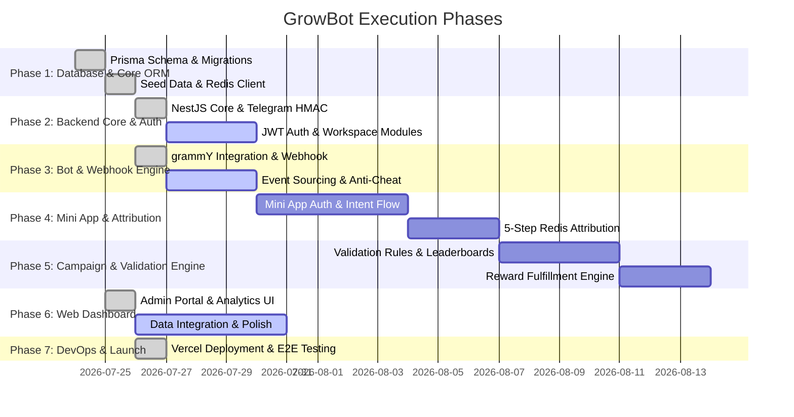

# GrowBot - Master Implementation Roadmap & Phased Execution Plan

This document outlines the step-by-step master execution plan for **GrowBot** based on the Phase 1 Product Specification (`doc/phase-1.md`) and Database Schema Specification (`doc/db-design.md`).

---

## 🏗 Architectural Summary

GrowBot consists of three core components:
1. **NestJS Backend API & Telegram Bot** – Manages Telegram webhooks (`chat_member`), Redis referral intent validation, event sourcing, background jobs, and REST APIs.
2. **Telegram Mini App (Vue 3)** – Provides seamless 1-tap Telegram authentication (`initDataRaw` HMAC validation), rate-limit-free referral intent registration, and member progress views.
3. **Web Dashboard (Vue 3)** – Centralized administration portal for community owners to manage workspaces, configure campaigns and validation rules, inspect growth analytics, and fulfill rewards.

### Technology Stack (Actual)

| Layer | Technology |
|---|---|
| **Monorepo** | pnpm workspaces + Turborepo |
| **Backend** | NestJS 11, TypeScript, grammY, Prisma ORM |
| **Frontend** | Vue 3, Vite, Pinia, Vue Router, Lucide Icons |
| **Database** | PostgreSQL (Prisma Postgres) |
| **Cache** | Redis |
| **Deployment** | Vercel (Serverless Functions + Static Hosting) |
| **Bot Framework** | grammY (Telegram Bot API) |

> **Note:** The original spec called for Next.js/React + Tailwind/shadcn. The actual implementation uses **Vue 3 + Vite + Pinia** for the frontend and **Vercel** for deployment instead of Docker/VPS.

---

## 🗺 Implementation Phases Overview

---

## Phase 1: Database Architecture & Core Data Access Layer ✅ COMPLETE

**Goal:** Establish PostgreSQL database schema with Prisma ORM, Redis caching layer, seed scripts, and core data models.

### Tasks
- [x] Initialize Prisma ORM in `packages/database` with PostgreSQL connector.
- [x] Implement full `schema.prisma` definition matching `doc/db-design.md`:
  - `User`, `Workspace`, `Community`, `Campaign`, `CampaignValidationRule`, `CommunityMember`, `CampaignParticipant`, `Referral`, `CampaignEvent`, `Reward`, `CommunityDailyStat`, `TelegramEventLog`.
- [x] Push schema to both local and production PostgreSQL databases.
- [x] Configure Redis client connection module in NestJS for:
  - Temporary referral intent storage (`pending_ref:{inviteeId}:{communityChatId}`).
  - Session caching.
  - Rate limiting.
- [x] Write seed script (`packages/database/prisma/seed.ts`) generating:
  - 6 users (admin + 5 participants)
  - 2 workspaces (PRO + FREE plans)
  - 2 communities (Supergroup + Channel)
  - 2 campaigns with validation rules (Milestone + Leaderboard)
  - 5 campaign participants with leaderboard metrics
  - 3 reward records (Delivered, Pending, Approved)
  - 7 days of community daily analytics stats
- [x] Seed both local and **production** Prisma Postgres databases.

### Deliverables & Verification
- ✅ `prisma db push` completes cleanly on local and production.
- ✅ `pnpm --filter @growbot/database seed` successfully populates all test records.
- ✅ Redis module configured and operational in NestJS.

---

## Phase 2: Backend Infrastructure & NestJS API Core 🔶 PARTIAL

**Goal:** Build the core NestJS API backend, Telegram cryptographic authentication, JWT session management, and workspace CRUD.

### Tasks
- [x] Initialize NestJS backend (`apps/api`) with TypeScript, ConfigModule, and modular architecture.
- [x] **Workspace Management Module**:
  - CRUD operations for `Workspace` with Prisma queries and mock fallback.
  - `GET /api/workspaces` endpoint with JWT guard.
- [x] **Community Management Module**:
  - Community listing API with Prisma queries (`GET /api/communities`).
  - Community membership sync helper services.
- [x] **Campaign Management Module**:
  - `GET /api/campaigns` with Prisma queries (includes validation rules, participant/referral counts).
  - `GET /api/campaigns/leaderboard` with Prisma participant ranking.
- [x] **Reward Management Module**:
  - `GET /api/rewards` with Prisma queries (includes campaign + user relations).
  - `PATCH /api/rewards/:id/status` for admin reward status updates.
- [ ] **Telegram Authentication Module** (NOT YET IMPLEMENTED):
  - Implement HMAC-SHA256 verification for Telegram Mini App `initDataRaw`.
  - Implement HMAC verification for Telegram Web Widget login data.
  - Implement JWT token generation & refresh logic.
  - Implement `@AuthUser()` decorator and `JwtAuthGuard` (scaffold exists, needs real Telegram verification).

### Deliverables & Verification
- ✅ All API endpoints return live PostgreSQL data from seeded database.
- ⬜ Telegram HMAC signature verification (not yet implemented).
- ⬜ Full JWT authentication flow with real Telegram login.

---

## Phase 3: Telegram Bot Engine & Webhook Event Receiver ✅ COMPLETE

**Goal:** Integrate the Telegram Bot API using grammY, handle webhooks securely, process group/channel membership events, and implement event sourcing & anti-cheat revocation.

### Tasks
- [x] Integrate **grammY** framework into NestJS (`BotModule` + `BotService`).
- [x] Setup secure Telegram Webhook endpoint (`POST /api/telegram/webhook`) with secret token verification (`X-Telegram-Bot-Api-Secret-Token`).
- [x] Configure dual-mode operation: **Long Polling** (local dev) and **Webhook** (production).
- [x] Lazy `bot.init()` inside `processUpdate()` for serverless cold-start compatibility.
- [x] **Bot Command Handlers**:
  - `/start` – Welcome message with Mini App keyboard button.
  - `/help` – Command reference guide.
  - `/stats` – Referral performance metrics.
- [x] **Membership Webhook Listener**:
  - Process `chat_member` updates.
  - Handle `member` status → referral validation check via `ReferralService`.
  - Handle `left`/`kicked` status → anti-cheat credit revocation.
- [x] **Anti-Cheat Credit Revocation**:
  - `chat_member.status === "left" | "kicked"` → mark referral as `REVOKED`.
- [x] Deploy to production Vercel with webhook URL registered.

### Deliverables & Verification
- ✅ Webhook endpoint returns `HTTP 200` for valid Telegram updates.
- ✅ `getWebhookInfo` shows `pending_update_count: 0`.
- ✅ Bot commands (`/start`, `/help`, `/stats`) respond correctly.
- ✅ `GET /api/telegram/webhook` health check returns `{"ok":true}`.
- ⬜ Event sourcing via `CampaignEvent` records (scaffolded, needs full integration).

---

## Phase 4: Telegram Mini App & 5-Step Referral Attribution Engine ⬜ NOT STARTED

**Goal:** Build the Telegram Mini App frontend and complete the 5-step Redis-backed referral attribution flow.

### Tasks
- [ ] **Mini App Frontend (Vue 3)**:
  - Setup Mini App page/route in `apps/web` (or separate app).
  - Integrate Telegram WebApp SDK (`@telegram-apps/sdk`).
  - Implement automatic Telegram 1-tap authentication on app mount.
  - Mini App UI: Campaign landing view, referral progress bar, earned rewards list.
- [ ] **5-Step Referral Attribution Flow**:
  - **Step 1**: Inviter generates Mini App link `https://t.me/GrowBotApp/app?startapp=ref_CODE`.
  - **Step 2**: Invitee opens Mini App; backend authenticates `initDataRaw`.
  - **Step 3 (Intent Registration)**: Invitee taps *"Join Community"*; NestJS writes Redis key `pending_ref:{inviteeId}:{communityChatId}` (24h TTL) and emits `INTENT_CREATED` event.
  - **Step 4**: Invitee is redirected to Telegram group/channel and joins.
  - **Step 5 (Attribution & Credit)**: Bot webhook receives join → matches against Redis key → creates `Referral` → evaluates `CampaignValidationRule` → emits `REFERRAL_VALIDATED` event → deletes Redis key.

### Deliverables & Verification
- Complete end-to-end simulated referral test from link tap to PostgreSQL credit.
- Zero Bot API rate limits incurred during link generation.

---

## Phase 5: Campaign Engine & Validation Rules ⬜ NOT STARTED

**Goal:** Build the campaign lifecycle manager, validation rule engine, leaderboard calculator, and reward fulfillment service.

### Tasks
- [ ] **Campaign Management API** (REST endpoints exist, needs full lifecycle):
  - Create/Update/Pause/Delete campaigns (`MILESTONE` vs `LEADERBOARD`).
  - Attach normalized `CampaignValidationRule` records (`IMMEDIATE`, `TIME_BOUND`, `MESSAGE_COUNT`).
- [ ] **Validation Rule Engine**:
  - `IMMEDIATE`: Validate referral instantly upon join.
  - `TIME_BOUND`: Queue background job (BullMQ/Redis) to check membership after configured hours.
  - `MESSAGE_COUNT`: Listener for group messages to increment `CommunityMember.messageCount`.
- [ ] **Leaderboard Engine** (basic version exists):
  - Fast query service for campaign rankings using `@@index([campaignId, validatedReferrals(sort: Desc)])`.
- [ ] **Reward Management Module** (basic version exists):
  - Automatic reward issuance when target reached or campaign ends.
  - Admin reward status updates (`PENDING`, `APPROVED`, `DELIVERED`, `REJECTED`).

### Deliverables & Verification
- Unit & integration tests for all 3 validation rule types.
- Leaderboard ranking API returning top inviters correctly sorted.

---

## Phase 6: Web Dashboard (Admin Portal) 🔶 PARTIAL

**Goal:** Develop a modern, responsive Web Dashboard for community owners to manage campaigns, monitor analytics, and oversee rewards.

### Tasks
- [x] **Frontend Foundation**:
  - Vue 3, Vite, TypeScript, Pinia, Vue Router, Lucide Icons.
  - Dark mode aesthetic with glassmorphism design system.
- [x] **Dashboard Views**:
  - `DashboardView` – Overview stats (total referrals, active campaigns, communities, participants).
  - `CampaignsView` – Campaign cards with status, type, participants, and validation rules.
  - `LeaderboardView` – Ranked participant table with referral counts and reward status.
  - `RewardsView` – Reward management table with status badge updates.
  - `CommunitiesView` – Community cards with member counts, bot status, and chat type.
  - `SettingsView` – Workspace settings, plan management, danger zone.
- [x] **Component Library**:
  - `Header`, `Sidebar`, `StatCard`, `GrowthChart`, `CampaignCard`, `LeaderboardTable`, `RewardTable`, `CommunityCard`.
- [x] **Pinia Stores Connected to API**:
  - `workspaceStore` → fetches live data from `GET /api/workspaces` and `GET /api/communities`.
  - `campaignStore` → fetches live data from `GET /api/campaigns`, `GET /api/campaigns/leaderboard`, `GET /api/rewards`.
- [ ] **Authentication & Workspace Navigation** (NOT YET):
  - Telegram Web Login widget & JWT session persistence.
  - Workspace selector & community onboarding wizard.
- [ ] **Export & Settings**:
  - CSV/Excel data export for campaign reports.

### Deliverables & Verification
- ✅ Dashboard loads within < 1.5 seconds.
- ✅ All views render seeded PostgreSQL data via API.
- ⬜ Campaign creation wizard UI.
- ⬜ Export functionality.

---

## Phase 7: Infrastructure, Testing, Monitoring & Production Deployment 🔶 PARTIAL

**Goal:** Deploy the stack, execute end-to-end testing, configure monitoring, and ensure production reliability.

### Tasks
- [x] **Vercel Deployment**:
  - Vue 3 frontend served as static assets via `outputDirectory: apps/web/dist`.
  - NestJS API served as Vercel Serverless Function via `api/index.js` (plain JS, CommonJS, requires pre-compiled dist).
  - `@growbot/database` CommonJS entry point (`packages/database/index.js`) for serverless compatibility.
  - `vercel.json` rewrites routing `/api/*` → serverless function, `/*` → static SPA.
- [x] **Telegram Webhook Production Setup**:
  - Webhook URL registered: `https://grow-bot-brown.vercel.app/api/telegram/webhook`.
  - Secret token verification active.
  - `getWebhookInfo` shows `pending_update_count: 0` (all updates processing successfully).
- [x] **Production Database**:
  - Schema pushed to Prisma Postgres (`pooled.db.prisma.io`).
  - Production database seeded with full domain data.
- [ ] **Containerization** (deferred – using Vercel instead):
  - Docker/docker-compose for local development only.
- [ ] **Security Auditing**:
  - Rate limiting on Mini App endpoints.
  - Input validation sanitization (`class-validator` configured).
- [ ] **CI/CD Pipeline**:
  - GitHub Actions workflow for linting, testing, building.
- [ ] **Monitoring & Logging**:
  - Sentry integration.
  - Health check endpoints.

### Deliverables & Verification
- ✅ Production deployment live at `https://grow-bot-brown.vercel.app`.
- ✅ Frontend and API both accessible from single origin.
- ✅ Telegram bot webhook processing updates successfully.
- ⬜ CI/CD pipeline.
- ⬜ Monitoring/Sentry integration.

---

## 📊 Overall Progress Summary

| Phase | Status | Completion |
|-------|--------|------------|
| **Phase 1**: Database & Core ORM | ✅ Complete | 100% |
| **Phase 2**: Backend Core & Auth | 🔶 Partial | 70% |
| **Phase 3**: Bot & Webhook Engine | ✅ Complete | 100% |
| **Phase 4**: Mini App & Attribution | ⬜ Not Started | 0% |
| **Phase 5**: Campaign & Validation Engine | ⬜ Not Started | 0% |
| **Phase 6**: Web Dashboard | 🔶 Partial | 75% |
| **Phase 7**: DevOps & Launch | 🔶 Partial | 60% |

### Key Remaining Work
1. **Telegram HMAC Authentication** – Real `initDataRaw` verification for Mini App and Web Login.
2. **Mini App Frontend** – Campaign landing, referral progress, 5-step attribution flow.
3. **Validation Rule Engine** – `TIME_BOUND` background jobs, `MESSAGE_COUNT` listener.
4. **Campaign CRUD** – Full create/update/pause/delete lifecycle in API and dashboard.
5. **Export & Reporting** – CSV/Excel data export.
6. **CI/CD & Monitoring** – GitHub Actions, Sentry.

---

## 🎯 Summary of Key Deliverables by File

- 📄 **[doc/phase-1.md](phase-1.md)**: Product Specification & Functional Requirements.
- 🗄 **[doc/db-design.md](db-design.md)**: Database Architecture, ERD, and Prisma Schema.
- 🗺 **[doc/plan.md](plan.md)**: Master Implementation Roadmap (Phases 1 - 7).
- 📘 **[README.md](../README.md)**: Project Overview & Architecture Guide.
